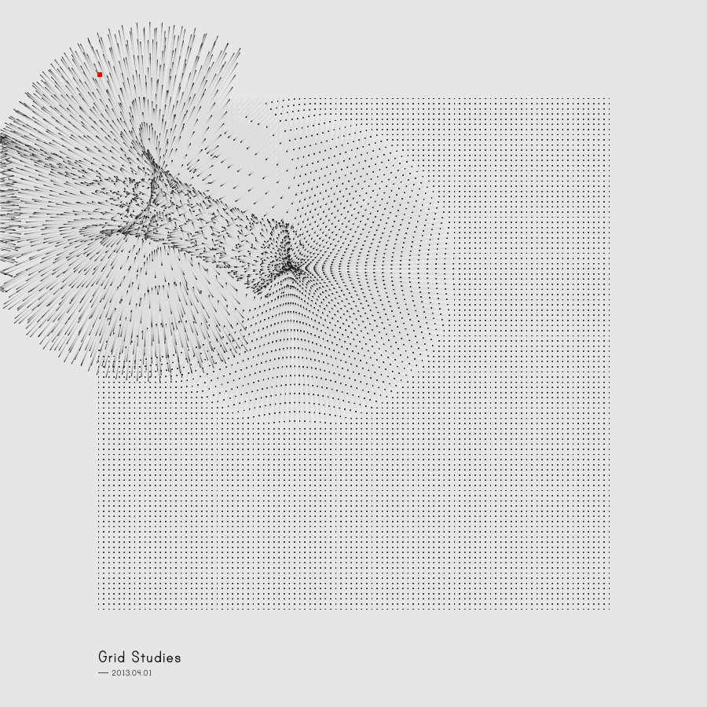

# Day 02

## Grids & Iterative Patterns

### Retro Bubbles

Full and empty circles are arranged in a grid and given random diameters.


<iframe src="content/day02/01/embed.html" width="100%" height="450" frameborder="no"></iframe>

[Full screen](/content/day02/01/embed.html)

### Bubbling Cube

In a cubic grid spheres in random sizes are being created.


<iframe src="content/day02/02/embed.html" width="100%" height="450" frameborder="no"></iframe>

[Full screen](/content/day02/02/embed.html)

### Exploding Cube

I was inspired by [Refik Anadol's Grid Studies](https://www.behance.net/gallery/8070375/Generative-Sketches-()-Grid-Studies). I wanted to create a similar effect in 3D space.

[One of Refik Anadol's Grid Studies (last opened 15.09.2022)](https://www.behance.net/gallery/8070375/Generative-Sketches-()-Grid-Studies/modules/61037471)

Same size spheres are arranged in a cubic grid. A random point within the grid is chosen. From that position an increasing diameter pushes away the surrounding spheres.


<iframe src="content/day02/03/embed.html" width="100%" height="450" frameborder="no"></iframe>

[Full screen](/content/day02/03/embed.html)