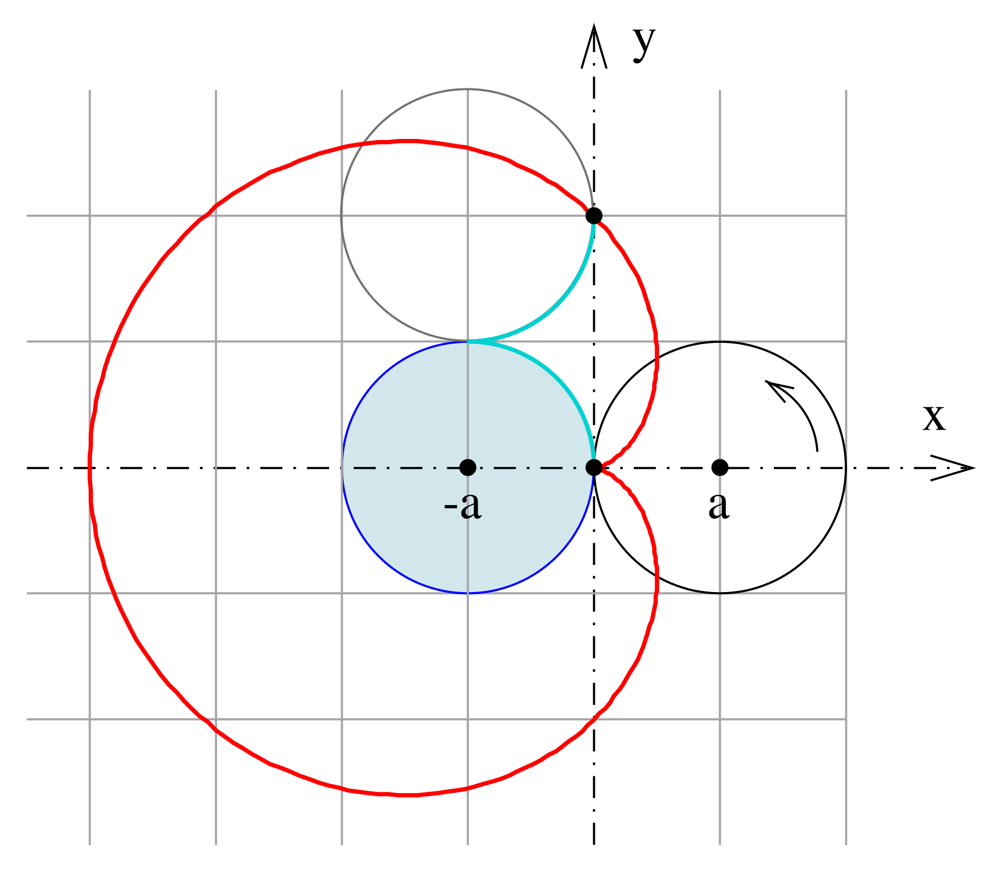

# Day 04

## Machines

### Scribble Machine

This is my first attempt at creating a random drawing machine. A line starts at a border and continuously connects to random points within the canvas. Once it comes close to a border, it stops and a new line in a new color begins. It stops when the HSB hues have reached an end.


<iframe src="content/day04/01/embed.html" width="100%" height="450" frameborder="no"></iframe>

[Full screen](/content/day04/01/embed.html)

### Cardioid

The following is one approach to constructing a cardioid. Another possibility is to use two circles, as you can see below. These circles moving around each other led to the next idea.


<iframe src="content/day04/02/embed.html" width="100%" height="450" frameborder="no"></iframe>

[Full screen](/content/day04/02/embed.html)

Cardioid constructed with two circles [(Wikipedia, last opened 17.09.2022)](https://en.wikipedia.org/wiki/Cardioid)

### Mandala Machine

Three randomly sized circles are moving around each other while following a circular path. Even though their sizes are random, they are based on the size of the previous circle. Another random factor is the shape (circle, square, ellipse) and size of the displayed objects.


<iframe src="content/day04/03/embed.html" width="100%" height="450" frameborder="no"></iframe>

[Full screen](/content/day04/03/embed.html)