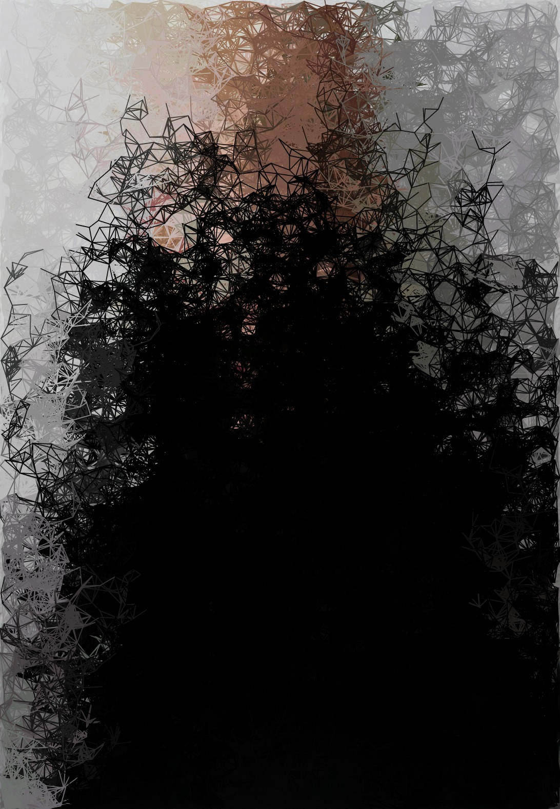
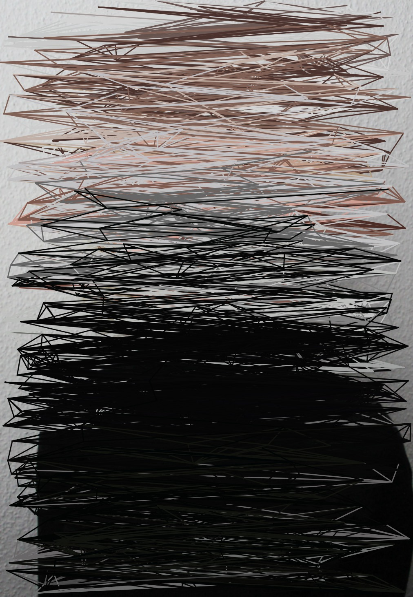
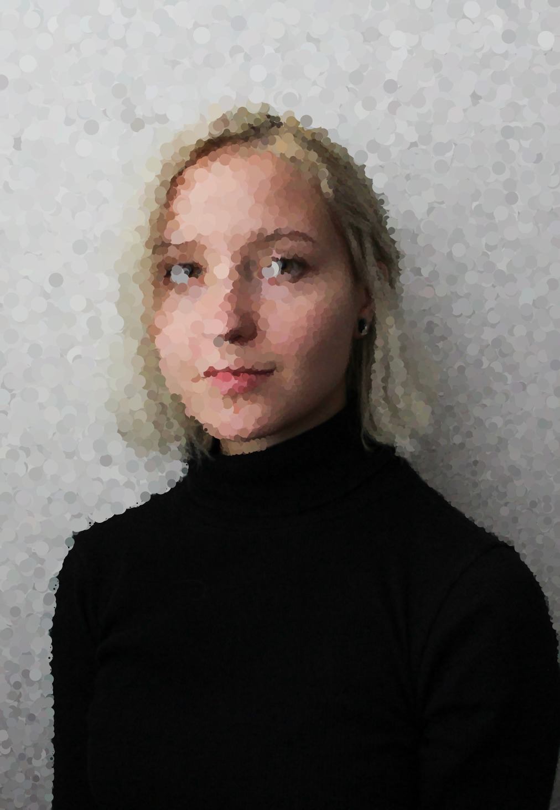

# Day 06

## Faces

In a couple of attempts I tried using face recognition tools. It worked inconsistently and it was hard to fix the errors since it's someone else's code. I decided that I have already spent too much time on this and therefore would continue.

### Filters

I was inspired by the following Pinterest post. In an attempt to replicate it, I came to these tree-like structures. I assume some differences to the reference are created by the randomness of the connected points.


<iframe src="content/day06/04/embed.html" width="100%" height="450" frameborder="no"></iframe>


I took the idea of lines and color further, which created a scratched effect.


<iframe src="content/day06/05/embed.html" width="100%" height="450" frameborder="no"></iframe>


The final filter again chooses random points which display the underlying color as a circle on top. The higher the sum of the rgb color the bigger the circle.


<iframe src="content/day06/06/embed.html" width="100%" height="450" frameborder="no"></iframe>
