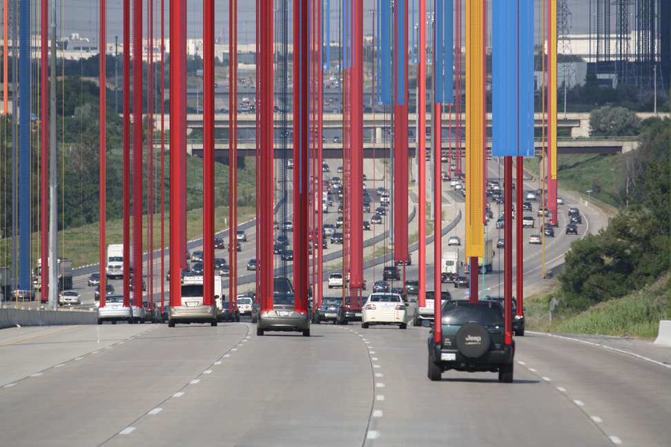

# Day 07

## Pixels

Like the previous day I fokused on the images' color and their manipulation. The results of both days turned out to be filter-like. Preserving only a part of an image and its color, it was interesting to see how much the modified parts would still resemble the original.

### Filters

I did not have one specific artwork in mind as a reference. I think stretching out some or all colors of an image like Kim Asendorf's work shown below, is a rather well known effect and I got inspired by the general idea of it.

[Artwork by Kim Asendorf (last opened 15.09.2022)](https://kimasendorf.tumblr.com/post/51826847543)

The starting value on the x axis is given by the mouse position and the y values are chosen randomly. The stripe height extends to the next random value.


<iframe src="content/day07/01/embed.html" width="100%" height="450" frameborder="no"></iframe>


The same concept, but the random y values reselected every frame.


<iframe src="content/day07/02/embed.html" width="100%" height="450" frameborder="no"></iframe>


Here the starting x value is randomly chosen. I decided to add noise along the stripes and the starting points.


<iframe src="content/day07/03/embed.html" width="100%" height="450" frameborder="no"></iframe>


I remembered some filters that used to be available in some photo editing apps. They achieved a similar look to Kelly Orth's artwork.

[Artwork by Kelly Orth (last opened 15.09.2022)](https://pin.it/4pcsxUH)

I wanted to combine the abstraction of the previous filters and these circles. Circle diameters are randomly chosen and the underlying colors of various points are displayed as a gradiant along the circle.


<iframe src="content/day07/04/embed.html" width="100%" height="450" frameborder="no"></iframe>
